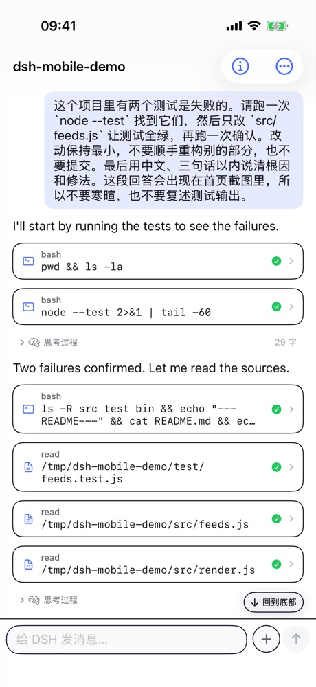
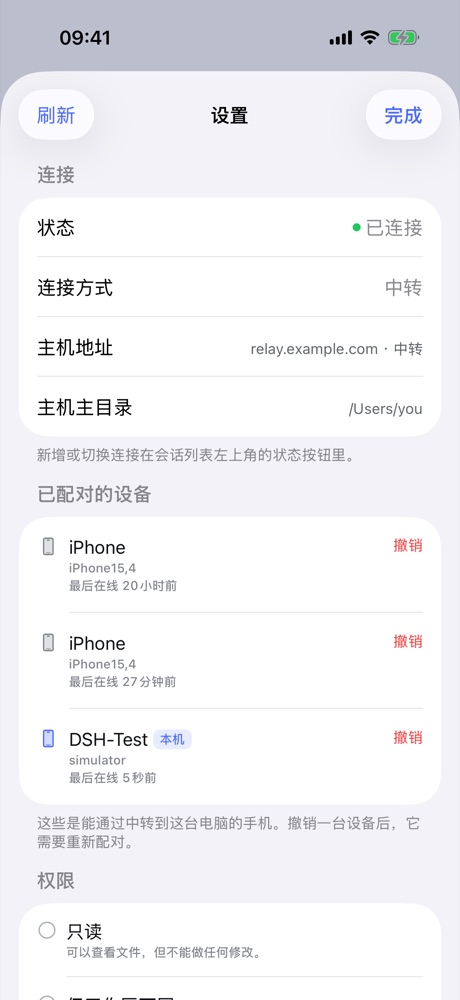

# DSH Mobile

[](https://github.com/jayantTang/DSH_Mobile/actions/workflows/ci.yml)
[](LICENSE)

**把电脑上的 [DSH](https://github.com/deepseek-ai/dsh) 装进 iPhone。**

原生 iOS 客户端 + 电脑侧连接器 + 可自建的公网中转。手机与电脑连同一个 DSH host：同一批会话、
同一条消息流，电脑上跑着的任务锁屏再打开进度还在走，电脑上挂起的提问手机上直接答。

**电脑不需要公网 IP，也不需要装 Tailscale。**

| 手机上看 agent 干活 | 管理连接与权限 |
|---|---|
|  |  |

> 配图出自一个合成会话（内容是真的 agent 输出，项目是编的），生成方式见 [`docs/artifacts/demo/`](docs/artifacts/demo)。

## 两条路

| | **A · 用现成中转**（推荐，5 分钟） | **B · 自己开中转** |
|---|---|---|
| 适合 | 只想赶紧用起来 | 想要完全自主、不依赖别人的机器 |
| 需要 | 一个**邀请码**（在 [issue #1 · 领邀请码](https://github.com/jayantTang/DSH_Mobile/issues/1) 领取） | 一台有公网 IP 的主机 + Caddy |
| 你要做的 | 装连接器 → 填邀请码 → 扫码 | 部署中转 → 铸码 → 装连接器 → 扫码 |

两条路的第 3 步之后完全一样（手机扫码配对）。下面先走 A；B 见[自己开中转](#自己开中转)。

## A · 用现成中转（推荐）

```
① 手机装 App      Safari 打开 https://testflight.apple.com/join/tHKQsbCk → 接受 → 安装
② 电脑装连接器    dsh plugin --profile web add dsh-plugin-mobile-link
③ 登记到中转      dsh-mobile-link enroll --invite <邀请码> --relay wss://<中转地址>/dsh-link
④ 重启 DSH        dsh web
⑤ 扫码配对        手机 App → 底部「扫码配对」→ 扫电脑上的二维码
```

**邀请码在 [issue #1 · 领邀请码](https://github.com/jayantTang/DSH_Mobile/issues/1) 里领**（一次性、绑一台电脑、用完补新的）。
上面的 `<中转地址>` 也在那里，和邀请码写在同一行。

二维码在电脑上打开：DSH 界面里的「移动端连接」，或 `http://127.0.0.1:<端口>/mobile-link/qr`
（端口见 `~/.dsh/desktop-shell/endpoint.json`）。

> 卡住了？先看 [`docs/ONBOARDING.md`](docs/ONBOARDING.md) 的排查表；还不行就在 issue 下面回，
> 把现象与 `dsh-mobile-link --log-level debug --once` 的输出贴上。

## B · 自己开中转

```bash
cd relay
export DSH_RELAY_SITE=<你的站点>            # 仓库里只有占位符，真值属于部署方
sudo -E ./deploy/deploy.sh                  # 幂等：建用户、装 systemd 单元、插 Caddy 路由
python3 admin.py --db state.db account-create --name "<你>"
python3 admin.py --db state.db invite-mint --note "给自己" --count 1 \
    --relay wss://<你的站点>/dsh-link       # 铸一个邀请码，回到 A 的第 ③ 步用它
```

实时负载与每设备流量：`curl -s http://127.0.0.1:8787/stats`（只监听回环）。
细节与限额说明见 [`relay/README.md`](relay/README.md)。

## 功能

| | |
|---|---|
| **会话** | 按项目目录分组、归档与找回、新建接续会话 |
| **对话** | 流式输出、思考过程折叠、工具调用卡片、Markdown 与表格渲染 |
| **问答** | agent 的提问卡片可直接在手机上作答 |
| **图片** | 查看与点开放大；从相册或文件 App 发图进对话 |
| **文件** | 分块上传到会话工作区；代码高亮、diff、HTML 报告预览 |
| **设备** | 已配对设备列表与自助撤销；邀请码自助登记，别人也能连他们自己的电脑 |

## 架构

```
┌──────────────┐   WSS    ┌────────────────────┐   WSS    ┌───────────────────┐
│  iPhone App  ├─────────►│  Relay（公网主机）  │◄─────────┤ 电脑侧连接器       │
│  SwiftUI     │          │  鉴权 + 转发        │          │ (DSH 插件)        │
└──────────────┘          └────────────────────┘          └─────────┬─────────┘
                                                                    │ HTTP + WS
                                                          ┌─────────▼─────────┐
                                                          │ dsh web           │
                                                          │ 127.0.0.1:<port>  │
                                                          └───────────────────┘
```

- 中转**不解析会话内容**，只按 `agentId` 转发帧；连接器始终以 `127.0.0.1` 访问本机 DSH，
  不开新端口、不改写 `Host`。
- 产品上**只提供经中转这一条连接方式**，不给用户选（`dsh://direct` 是 DEBUG-only 的测试通道）。
- 选型与边界：[`docs/ARCHITECTURE.md`](docs/ARCHITECTURE.md)、[`docs/PAIRING.md`](docs/PAIRING.md)。

## 中转

中转可以**用别人的**（拿邀请码登记即可，你不需要有服务器），也可以自己开一台：

```bash
cd relay
export DSH_RELAY_SITE=<你的站点>            # 仓库里只有占位符，真值属于部署方
sudo -E ./deploy/deploy.sh                  # 幂等：建用户、装 systemd 单元、插 Caddy 路由
python3 admin.py --db state.db account-create --name "<你>"
python3 admin.py --db state.db invite-mint --note "给某人" --count 1     # 铸邀请码给对方
```

运维侧的实时负载与每设备流量：`curl -s http://127.0.0.1:8787/stats`（只监听回环）。
细节见 [`relay/README.md`](relay/README.md)。

## 配置

仓库里出现的 `relay.example.com` 一律是**占位符**：中转地址属于部署方，不属于仓库。真值只存在本机、
且都被 gitignore：

| 位置 | 用途 | 怎么给真值 |
|---|---|---|
| `.env.local` | 发布脚本、开发探针 | `cp .env.example .env.local`，填 `DSH_SITE` / `DSH_RELAY_URL` / `DSH_OTA_HOST` |
| `~/.dsh/mobile-link/agent.json` | 连接器的中转地址与身份 | `dsh-mobile-link enroll --invite <码> --relay <地址>` |
| `ios/DSHMobile/Config.local.xcconfig` | App 内预填的中转地址与更新源 | `cp ios/DSHMobile/Config.xcconfig ios/DSHMobile/Config.local.xcconfig` 后填写 |

因此 clone 下来直接构建的 App **默认连不上任何中转**，这是有意为之。

## 开发

```bash
cd ios/DSHMobile/DSHKit && swift test        # 协议层 58 项（1 skip）
cd plugins/mobile-link  && npm test          # 连接器 104 项
cd relay && .venv/bin/python -m pytest -q    # 中转 107 项（1 skip）

# 构建 App
cd ios/DSHMobile && xcodebuild -scheme DSHMobile \
  -destination 'platform=iOS Simulator,name=DSH-Test' build
```

上面三套由 GitHub Actions 在**干净仓库**上各跑一遍，外加一次「不带任何本机配置」的 Release 构建。
需要仿真器、真实中转或开发者团队 ID 的验证不在 CI 里——CI 绿不等于可以发布。

界面测试是一套独立的测试台：`./test/run.sh prepare` → `run <用例>` → `report --verdict …`，
口径见 [`test/RULES.md`](test/RULES.md)。

## 文档

| 文档 | 内容 |
|---|---|
| [`docs/ONBOARDING.md`](docs/ONBOARDING.md) | 两条路怎么选、A 路五步怎么走、连不上怎么查 |
| [`docs/ARCHITECTURE.md`](docs/ARCHITECTURE.md) | 架构与关键决策 |
| [`docs/DSH-PROTOCOL.md`](docs/DSH-PROTOCOL.md) | DSH 原生协议参考（权威、实现导向） |
| [`docs/RELAY-PROTOCOL.md`](docs/RELAY-PROTOCOL.md) | DLP v1 中转协议规范 |
| [`docs/PAIRING.md`](docs/PAIRING.md) | 连接方式与配对设计 |
| [`docs/IMAGES.md`](docs/IMAGES.md) | 图片能力的设计约束与实现 |
| [`docs/VERSIONING.md`](docs/VERSIONING.md) | 三处部署的版本与发布策略 |
| [`docs/PRIVACY.md`](docs/PRIVACY.md) | 隐私说明：App 不收集数据，中转只做转发 |
| [`docs/dsh-rpc-catalog.json`](docs/dsh-rpc-catalog.json) | 机器可读的 RPC 目录 |
| [`docs/notes/`](docs/notes) | 实现与规范的偏差记录、发布与分发清单 |
| [`docs/artifacts/samples/`](docs/artifacts/samples) | 从真实 DSH 抓取的响应样例（已脱敏） |

## 已知限制

- **iOS 安装走 TestFlight**：需先装 Apple 的 TestFlight App，测试构建 **90 天后过期**，到期要装新构建。
  仓库里那条 OTA（`https://<站点>/ios/`）用 Ad Hoc 描述文件，只覆盖已登记 UDID 的设备，适合自用。
- 手机处于后台时，电脑端**新开始**的会话叫不醒 App——那需要 APNs，尚未实现。
- 后台通知靠无声音频保活，只在「有会话在跑或有待回答的提问」时生效。
- 文件发送只在经中转时可用。

## 许可

MIT，见 [`LICENSE`](LICENSE)。
