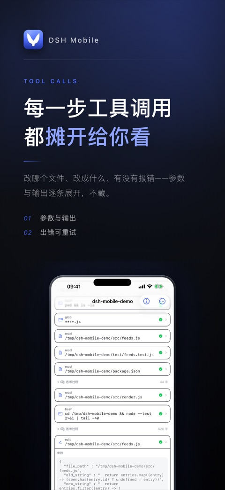
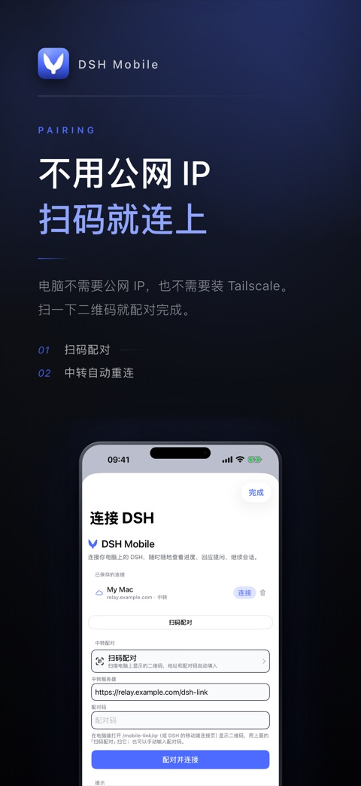
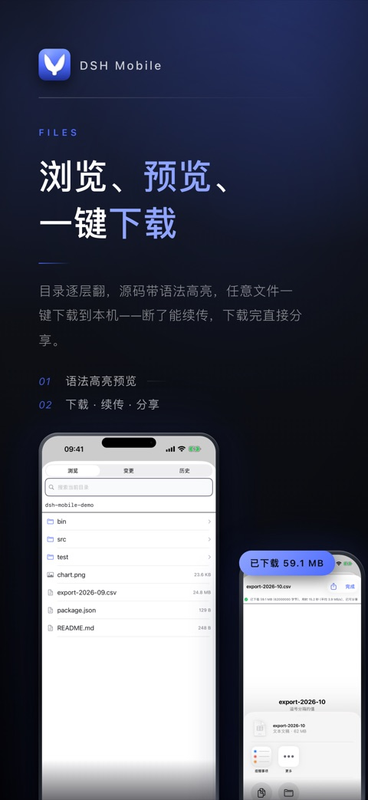
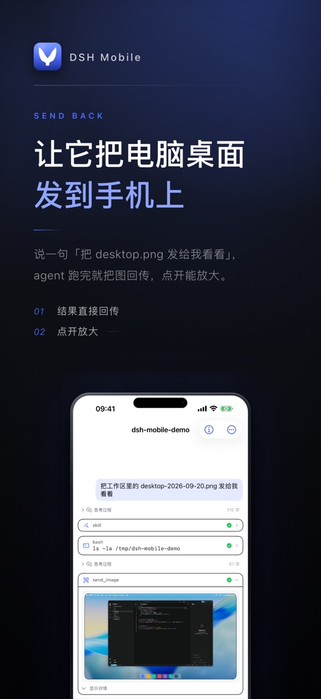

# DSH Mobile

[](https://github.com/deepseek-ai/deepseek-harness)
[](https://github.com/Dominic789654/awesome-deepseek-harness)
[](https://github.com/Dominic789654/awesome-deepseek-harness)
[](docs/VERSIONING.md)
[](https://testflight.apple.com/join/tHKQsbCk)
[](https://www.npmjs.com/package/dsh-plugin-mobile-link)
[](https://github.com/jayantTang/DSH_Mobile/actions/workflows/ci.yml)
[](LICENSE)

把电脑上的 [DSH](https://github.com/deepseek-ai/deepseek-harness) 会话接到 iPhone 上：原生 iOS
客户端、电脑侧连接器、可自建的公网中转。手机与电脑连接同一个 DSH host，看到同一批会话与同一条
消息流；电脑上运行中的任务在锁屏后继续执行，电脑上挂起的提问可在手机上直接回答。

电脑不需要公网 IP，也不需要 VPN。

| 每一步工具调用都摊开 | 不用公网 IP，扫码就连上 |
|---|---|
|  |  |
| 浏览、预览、一键下载 | 让它把电脑上的文件发回手机 |
|  |  |

> 配图为 App Store 宣传图（本仓库 8 张中的 4 张），内容出自同一套合成会话：输出是真实 agent 输出，
> 项目为虚构，`relay.example.com` 是占位符。素材与生成方式见 [`docs/artifacts/demo/`](docs/artifacts/demo)。

## 状态与兼容性

| 组件 | 当前版本 | 分发方式 |
|---|---|---|
| iOS App | 1.0 | TestFlight（[加入链接](https://testflight.apple.com/join/tHKQsbCk)）；测试构建 90 天过期 |
| 连接器 `dsh-plugin-mobile-link` | 0.3.0 | npm |
| 中转（DLP v1） | 本仓库 `relay/` | 自行部署 |

三者的版本组合与发布策略见 [`docs/VERSIONING.md`](docs/VERSIONING.md)。

## 前提

- 电脑上已安装并可运行 DSH（`dsh web`）。
- 连接器需要 Node.js ≥ 22。
- 自建中转需要一台有公网 IP 的主机（macOS 或 Linux）与 Caddy。
- 从源码构建 App 需要 macOS + Xcode 16 以上；日常使用不需要。

## 快速开始

### A. 使用公共中转

1. 手机上通过上面的 TestFlight 链接安装 App。
2. 电脑上安装连接器：`dsh plugin --profile web add dsh-plugin-mobile-link`
3. 登记到中转：`dsh-mobile-link enroll --invite <邀请码> --relay wss://<中转地址>/dsh-link`
4. 重启 DSH：`dsh web`
5. 手机 App →「扫码配对」，扫描电脑上的二维码。二维码可在 DSH 界面的「移动端连接」打开，或访问
   `http://127.0.0.1:<端口>/mobile-link/qr`（端口见 `~/.dsh/desktop-shell/endpoint.json`）。

邀请码为一次性、绑定一台电脑，在 [issue #1](https://github.com/jayantTang/DSH_Mobile/issues/1) 领取；
中转地址与邀请码写在同一行。登录后确认手机顶部显示「已连接」，即为成功。故障排查见
[`docs/ONBOARDING.md`](docs/ONBOARDING.md)。

### B. 自建中转

```bash
cd relay
export DSH_RELAY_SITE=<站点>                 # 仓库中只有占位符，真值属于部署方
sudo -E ./deploy/deploy.sh                   # 幂等：建用户、装 systemd 单元、挂 Caddy 路由
python3 admin.py --db state.db account-create --name "<名称>"
python3 admin.py --db state.db invite-mint --note "<备注>" --count 1 \
    --relay wss://<站点>/dsh-link            # 铸出的邀请码回到 A 的第 3 步使用
```

实时负载与每设备流量：`curl -s http://127.0.0.1:8787/stats`（仅监听回环）。限额与运维细节见
[`relay/README.md`](relay/README.md)。

## 组件与数据流

```
┌──────────────┐   WSS    ┌────────────────────┐   WSS    ┌───────────────────┐
│  iPhone App  ├─────────►│  Relay（公网主机）  │◄─────────┤ 电脑侧连接器       │
│  SwiftUI     │          │  鉴权 + 转发        │          │ (DSH 插件)        │
└──────────────┘          └────────────────────┘          └─────────┬─────────┘
                                                                     │ HTTP + WS
                                                           ┌─────────▼─────────┐
                                                           │ dsh web           │
                                                           │ 127.0.0.1:<port>  │
                                                           └───────────────────┘
```

| 组件 | 位置 | 职责 |
|---|---|---|
| iOS App | 手机 | 会话列表、转写、图片与文件、配对与设备管理 |
| 连接器 | 电脑（DSH 插件） | 以 `127.0.0.1` 访问本机 DSH，转成中转帧 |
| 中转 | 公网主机 | 鉴权与按 `agentId` 转发；**不解析会话内容** |
| DSH host | 电脑 | 会话、agent 与工具的真实执行方 |

产品上只提供经中转这一条连接方式（`dsh://direct` 是 DEBUG-only 的测试通道）。选型与边界见
[`docs/ARCHITECTURE.md`](docs/ARCHITECTURE.md) 与 [`docs/PAIRING.md`](docs/PAIRING.md)。

## 配置

仓库中出现的 `relay.example.com` 一律是占位符：中转地址属于部署方，不属于仓库。真值只存在于本机，
且均被 gitignore：

| 位置 | 用途 | 提供方式 |
|---|---|---|
| `.env.local` | 发布脚本、开发探针 | `cp .env.example .env.local`，填 `DSH_SITE` / `DSH_RELAY_URL` / `DSH_OTA_HOST` |
| `~/.dsh/mobile-link/agent.json` | 连接器的中转地址与身份 | `dsh-mobile-link enroll --invite <码> --relay <地址>` |
| `ios/DSHMobile/Config.local.xcconfig` | App 内预填的中转地址与更新源 | 从 `Config.xcconfig` 复制后填写 |

因此直接 clone 构建出的 App 默认连不上任何中转，这是有意设计。

## 开发

```bash
cd ios/DSHMobile/DSHKit && swift test        # 协议层
cd plugins/mobile-link  && npm test          # 连接器
cd relay && .venv/bin/python -m pytest -q    # 中转
npm run check:secrets                        # 本机真值没有进跟踪文件
npm run check:docs                           # 文档规范（结构、口吻、链接）

cd ios/DSHMobile && xcodebuild -scheme DSHMobile \
  -destination 'platform=iOS Simulator,name=DSH-Test' build
```

上述单测与一次「不带任何本机配置」的 Release 构建由 GitHub Actions 在干净仓库上执行。需要仿真器、
真实中转或开发者团队 ID 的验证不在 CI 内——CI 通过不等于可以发布。

界面测试是一套独立测试台：`./test/run.sh prepare` → `run <用例>` → `report --verdict …`，口径见
[`test/RULES.md`](test/RULES.md)，可复制的用例模板见 [`test/examples/`](test/examples)。

## 文档

| 文档 | 内容 |
|---|---|
| [`docs/ONBOARDING.md`](docs/ONBOARDING.md) | 两种部署路径的选择、操作步骤、故障排查 |
| [`docs/GLOSSARY.md`](docs/GLOSSARY.md) | 术语表（DSH、host、连接器、中转、DLP 等） |
| [`docs/ARCHITECTURE.md`](docs/ARCHITECTURE.md) | 架构与关键决策 |
| [`docs/DSH-PROTOCOL.md`](docs/DSH-PROTOCOL.md) | DSH 原生协议参考（权威、面向实现） |
| [`docs/RELAY-PROTOCOL.md`](docs/RELAY-PROTOCOL.md) | DLP v1 中转协议规范 |
| [`docs/CONNECTOR-NOTES.md`](docs/CONNECTOR-NOTES.md) / [`docs/RELAY-NOTES.md`](docs/RELAY-NOTES.md) | 实现与规范的偏差记录 |
| [`docs/PAIRING.md`](docs/PAIRING.md) | 连接方式与配对设计 |
| [`docs/IMAGES.md`](docs/IMAGES.md) | 图片能力的设计约束与实现 |
| [`docs/VERSIONING.md`](docs/VERSIONING.md) | 三处部署的版本与发布策略 |
| [`docs/PRIVACY.md`](docs/PRIVACY.md) | 隐私说明：App 不收集数据，中转只做转发 |
| [`docs/dsh-rpc-catalog.json`](docs/dsh-rpc-catalog.json) | 机器可读的 RPC 目录 |
| [`docs/artifacts/samples/`](docs/artifacts/samples) | 从真实 DSH 抓取的响应样例（已脱敏） |

参与开发见 [`CONTRIBUTING.md`](CONTRIBUTING.md)，安全问题的报告方式见 [`SECURITY.md`](SECURITY.md)，
版本变化见 [`CHANGELOG.md`](CHANGELOG.md)。

## 已知限制

- **iOS 安装走 TestFlight**：需先安装 Apple 的 TestFlight，测试构建 90 天后过期，到期需安装新构建。
  仓库提供的 OTA（`https://<站点>/ios/`）使用 Ad Hoc 描述文件，只覆盖已登记 UDID 的设备，适合自用。
- 手机处于后台时，电脑端**新开始**的会话无法唤起 App——需要 APNs，尚未实现。
- 后台通知依赖无声音频保活，仅在「有会话运行或有待回答的提问」时生效。
- 文件发送仅在经中转时可用。

## 许可

MIT，见 [`LICENSE`](LICENSE)。
